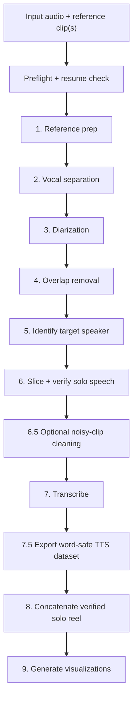

# Timbre

[](#requirements)
[](studio/)
[](#requirements)
[](LICENSE)

**Extract one clean target voice from messy multi-speaker audio, then export a
word-safe LJSpeech dataset ready for TTS training.**

[Studio](#desktop-app-timbre-studio) • [Colab](#google-colab) • [CLI](#command-line-quickstart) • [Features](#features) • [Output](#what-you-get) • [Troubleshooting](#troubleshooting) • [Contributing](#developer-notes)


Timbre takes a long recording, podcast, stream, or interview plus one or more short
reference clips of the target speaker. It separates vocals, diarizes speakers, removes
overlap, verifies the target voice, transcribes the kept speech, and cuts the result into
TTS-friendly clips whose boundaries are anchored in validated silence.

## Choose your path

| Path | Best for | Start here |
| --- | --- | --- |
| **Timbre Studio** | Local desktop extraction, YouTube pulls, reference picking, result review | [`studio/`](studio/) |
| **Google Colab** | Trying Timbre on a free T4 GPU without local setup | [Open the shared Colab notebook](https://colab.research.google.com/drive/1_Gs-l1HXKBZK67SQidgtMVVreMvzIhUV?usp=sharing) |
| **Command line** | Batch runs, scripting, reproducible datasets | [`python run_timbre.py`](#command-line-quickstart) |

## Desktop app: Timbre Studio

Timbre Studio is a native desktop console for the pipeline. Drop an audio/video file or
paste a YouTube link, add reference clips, press **RUN EXTRACTION**, and watch the real
pipeline stages stream through the UI.

Studio does not reimplement the ML stack. It shells out to `python run_timbre.py` in the
repo root and keeps the GUI aligned with the same CLI contract tested by the Python suite.

**What Studio gives you**

- Input cards for local media, YouTube downloads, target name, output folder, and multiple
  reference clips.
- A voice-sample finder that uses the repo VAD stack to rank speech-heavy candidate clips.
- One-click reference cleaning through the same vocal separator used by the pipeline.
- Run presets: **BALANCED**, **QUICK CHECK**, **WORD SAFE**, and **LOW VRAM**.
- A copyable command preview generated from the same pure settings helper as the run button.
- A results browser for dataset clips, the concatenated solo reel, spectrograms, run
  history, transcript filtering, and manifest copy actions.
- On Windows release builds, **OUTPUT -> SETUP** can provision the managed repo, Python
  environment, ffmpeg/ffprobe, yt-dlp, requirements, and FireRedVAD model under a folder
  you choose.

Run Studio from this checkout:

```bash
cd studio
npm install
npm run tauri dev
```

Build an installer:

```bash
cd studio
npm run tauri build
```

Requirements for Studio development: **Node.js 20+** and **Rust stable**. See the full
Studio guide in [`studio/README.md`](studio/README.md).

## Google Colab

Run Timbre in the browser on a free **T4 GPU**. Paste a YouTube link or upload a file,
choose a reference clip, run the pipeline, preview the results, and download the dataset.

[](https://colab.research.google.com/drive/1_Gs-l1HXKBZK67SQidgtMVVreMvzIhUV?usp=sharing)

## Features

- **Target-speaker extraction**: provide one or more clean references; multiple references
  are normalized and averaged into one target voice prototype.
- **True solo speech**: overlap is derived from diarization and excluded so kept clips are
  target-only regions.
- **Modern public model stack**: audio-separator for vocal separation, NeMo Sortformer for
  diarization, WeSpeaker and SpeechBrain ECAPA-TDNN for speaker verification, FireRedVAD
  with Silero fallback for VAD, and Nemotron or Whisper for ASR.
- **Word-safe TTS cutting**: acoustic silence is the cut authority. Force-split clips are
  flagged and quarantined from the dataset by default.
- **LJSpeech export by default**: writes `metadata.csv`, `train.csv`, `eval.csv`, and WAVs
  under `dataset/`; optional `metadata.jsonl` is available with `--dataset-format
  ljspeech+jsonl`.
- **Quality gate**: rejects clips that are too short/long, clipping, empty-transcript,
  unverified, or not silence-validated.
- **Unattended-run safety**: required resources fail loudly before the batch; optional tiers
  auto-disable with a log line instead of stalling the run.
- **Resume support**: completed runs are tracked so repeated work can be skipped; reference
  paths and target name are part of the completion key.
- **No telemetry**: nothing is phoned home by Timbre itself.

## Command-line quickstart

### 1. Install system tools

Install `ffmpeg` and `ffprobe` and make sure both are on `PATH`.

On Debian/Ubuntu:

```bash
sudo apt-get install -y libsndfile1 ffmpeg
pip install Cython packaging
```

### 2. Install Python dependencies

```bash
git clone https://github.com/Etherll/Timbre.git
cd Timbre
python -m venv .venv
```

Activate the environment:

```bash
# macOS / Linux
source .venv/bin/activate

# Windows PowerShell
.\.venv\Scripts\Activate.ps1
```

Install the ML stack:

```bash
pip install -r requirements.txt
```

> [!IMPORTANT]
> On Windows, run your terminal as Administrator or enable Windows Developer Mode before
> first installing/running Timbre. Some model caches create symlinks, and Windows can block
> those without elevated privileges.

### 3. Download FireRedVAD once

The default VAD path is `pretrained_models/FireRedVAD/VAD`.

```bash
pip install huggingface_hub
hf download FireRedTeam/FireRedVAD --local-dir pretrained_models/FireRedVAD
```

### 4. Run a smoke extraction

```bash
python run_timbre.py \
  --input-audio "podcast.wav" \
  --reference-audio "ref_01.wav" "ref_02.wav" \
  --target-name "Host" \
  --dry-run
```

Remove `--dry-run` for a full run:

```bash
python run_timbre.py -i "podcast.wav" -r "host_ref.wav" -n "Host"
```

## Prepare reference clips

You need one or more short, clean samples of the target speaker. `extract_reference.py`
is an FFmpeg-only helper that splits a media file on silence and writes candidate clips
plus a `manifest.csv`.

```bash
python extract_reference.py -i interview.mp4
python extract_reference.py -i interview.mp4 -o ref_clips --min-clip 3 --max-clip 15
python extract_reference.py -i interview.mp4 --longest-first --limit 5
python extract_reference.py -i interview.mp4 --list-only
```

Then pass the best clip or clips after `--reference-audio`:

```bash
python run_timbre.py -i "interview.wav" -r "ref_a.wav" "ref_b.wav" -n "Guest"
```

## What you get

Each run writes to:

```text
<output-base-dir>/<TargetName>_<input-stem>_extracted/
  separated_vocals/                  separated speech track
  target_segments_solo/              verified SOLO segment WAVs
  transcripts_solo_verified/         transcripts for accepted clips
  transcripts_solo_rejected/         transcripts for rejected clips, unless skipped
  concatenated_audio_solo_verified/  one continuous solo reel
  dataset/                           LJSpeech TTS dataset
  visualizations/                    spectrograms and comparison plots
  __tmp_processing/                  temp files, removed unless --keep-temp-files
```

The dataset layout is:

```text
dataset/
  metadata.csv                         id|transcript|normalized_transcript, no header
  metadata.jsonl                       optional, with --dataset-format ljspeech+jsonl
  wavs/<TargetName>/<id>.wav           mono 16-bit PCM @ --tts-sr, default 24000
  train.csv                            deterministic training split
  eval.csv                             deterministic disjoint eval split
  .completed.json                      resumable completion manifest
```

`metadata.csv`, `train.csv`, and `eval.csv` are always pipe-delimited with no header.
Loudness normalization is applied last, with a default target of `-23 LUFS`.

## How it works

The active pipeline is hard-wired in `run_timbre.py`. The stage protocol under
`timbre/pipeline/` exists for the future orchestration shape but is not the active
execution path yet.



### Model stack

| Stage | Default |
| --- | --- |
| Vocal separation | `audio-separator`, Mel-Band RoFormer `mel_band_roformer_kim_ft2_unwa.ckpt` |
| Diarization | NeMo Sortformer `nvidia/diar_sortformer_4spk-v1` |
| Target speaker ID | WeSpeaker Deep r-vector |
| Verification | WeSpeaker r-vector + WeSpeaker gemini + SpeechBrain ECAPA-TDNN |
| VAD | FireRedVAD, with Silero fallback when using `--vad-backend auto` |
| ASR | NVIDIA Nemotron 3.5 ASR, or Whisper with `--asr-backend whisper` |
| Dataset export | LJSpeech writer in `timbre/dataset_export.py` |

Verification fusion uses the fixed weights `rvector=0.4`, `ecapa=0.3`, `gemini=0.3`.
If a verifier is unavailable, its weight is dropped and the remaining scores are
renormalized instead of silently rejecting every clip.

## Useful CLI flags

Run `python run_timbre.py --help` for the full, tested CLI contract.

| Task | Flags |
| --- | --- |
| Pick input/reference/target | `-i/--input-audio`, `-r/--reference-audio`, `-n/--target-name` |
| Change output folder | `-o/--output-base-dir` |
| Fast smoke run | `--dry-run` |
| Skip separation | `--skip-separation` |
| Clean only noisy clips | `--classify-and-clean` |
| ASR backend | `--asr-backend nemotron` or `--asr-backend whisper` |
| Speaker embedding backend | `--embedding-backend wespeaker`, `ecapa`, or `titanet` |
| VAD backend | `--vad-backend auto`, `firered`, or `silero` |
| Word-safe timing | `--seg-min-length`, `--seg-max-length`, `--seg-hard-max`, `--seg-snap-tol` |
| Optional forced alignment | `--word-align` |
| Dataset export | `--export-tts`, `--no-export-tts`, `--tts-sr`, `--dataset-format` |
| Quality filter | `--qf-min-dur`, `--qf-max-dur`, `--allow-unvalidated-clips` |
| Low-memory run | `--low-vram`, `--device`, `--vram-budget`, `--asr-precision` |
| Resume control | `--resume`, `--no-resume` |

## Requirements

- **Python:** 3.10+
- **System tools:** `ffmpeg` and `ffprobe`
- **GPU:** NVIDIA GPU with 16 GB VRAM recommended for the full ML pipeline
- **CPU-only:** supported for some paths, but full extraction is slow
- **Studio development:** Node.js 20+ and Rust stable
- **Network:** needed on first run to download model weights

The automated test suite is CPU-only and stubs heavy ML modules; real inference should be
validated manually on a GPU machine after changing separation, diarization, verification,
VAD, ASR, or export-stage behavior.

## Troubleshooting

**FireRedVAD missing**

Preflight requires the FireRedVAD directory to exist and be non-empty. Download it once:

```bash
hf download FireRedTeam/FireRedVAD --local-dir pretrained_models/FireRedVAD
```

If FireRedVAD itself behaves poorly on your stack, keep the model present and run with
`--vad-backend silero`.

**Windows model-cache or symlink errors**

Run PowerShell, Command Prompt, or Windows Terminal as Administrator, or enable Windows
Developer Mode.

**Low VRAM**

Try:

```bash
python run_timbre.py -i in.wav -r ref.wav -n Target --low-vram --skip-separation
```

You can also reduce ASR memory pressure with `--asr-precision auto`.

**Optional tiers disappear**

`--word-align`, `--separation-tier`, and `--dnsmos-filter` are optional. If their
dependencies or weights are unavailable, preflight logs the auto-disable and continues.

**DNSMOS**

DNSMOS is experimental in this repo. The scorer import is guarded, so requesting it should
not crash the run.

**Separator checkpoint**

Separation requires a valid audio-separator checkpoint. If you only need a quick run, use
`--skip-separation`.

## Developer notes

The project intentionally has no package installer or console script. Run it directly:

```bash
python run_timbre.py --help
```

Run tests:

```bash
python -m pytest tests -q
```

Run Studio tests/build checks:

```bash
cd studio
npm test
npm run build
```

Useful files:

```text
run_timbre.py                 active end-to-end runner
extract_reference.py          FFmpeg-only reference-clip helper
audio_pipeline.py             heavy pipeline implementation
timbre/cli.py                 single source of truth for CLI flags
timbre/config.py              typed runtime config
timbre/word_safe_segmenter.py silence/VAD cut authority
timbre/dataset_export.py      LJSpeech writer and quality gate
timbre/preflight.py           fail-loud/fail-soft capability checks
studio/                       Tauri desktop app
docs/EXTENDING.md             extension points for models, stages, filters
tests/                        characterization net and golden CLI contract
```

When changing the CLI, update `timbre/cli.py` and the golden help snapshot in
`tests/golden/cli_help.txt` deliberately.

When changing ML inference stages, run the CPU tests and then do a manual Tier-2 GPU
check: real audio in, verified clips out, transcripts present, dataset written, and
accept/reject decisions plausible.

## License

Timbre is licensed under the **Apache License, Version 2.0**. See [`LICENSE`](LICENSE)
and [`NOTICE`](NOTICE).

Copyright 2026 Reis Cook.

## Issues and contact

Open an issue on GitHub or email `mrmrmidoessam@gmail.com`.
