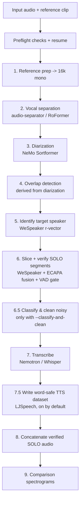

# Timbre

**Isolate, verify, and transcribe the clean solo speech of one target speaker from
multi-speaker audio — and export a ready-to-train, word-safe TTS dataset.**

Timbre takes a long multi-speaker recording (interview, podcast, stream) plus a
short reference clip of one person, and returns only that person's **non-overlapped,
speaker-verified** speech: as polished WAV segments, transcripts, visualizations, and an
LJSpeech-style TTS dataset whose clips never cut mid-word.

> **No Hugging Face token required.** Every model (audio-separator UVR models, NeMo
> `nvidia/*` models, `FireRedTeam/FireRedVAD`) is publicly downloadable — there are no gated
> repositories to request access to.

### Google Colab (GUI, no local install)

Run it in the browser on a free **T4 GPU** — paste a YouTube link or upload a file, pick a
reference clip in the form, and download a ready-to-train LJSpeech dataset:

[](https://colab.research.google.com/github/Etherll/Timbre/blob/main/Timbre_YouTube_to_TTS.ipynb)

[`Timbre_YouTube_to_TTS.ipynb`](https://github.com/Etherll/Timbre/blob/main/Timbre_YouTube_to_TTS.ipynb)
walks you through GPU check → install → input (YouTube/upload) → target + reference → run →
preview → download, all as Colab form cells.

---

## Contents

- [What it does](#what-it-does)
- [How it works](#how-it-works)
- [Tech stack](#tech-stack)
- [Requirements](#requirements)
- [Installation](#installation)
- [Download the VAD model](#download-the-vad-model)
- [Prepare a reference clip](#prepare-a-reference-clip)
- [Quickstart](#quickstart)
- [CLI reference](#cli-reference)
- [TTS dataset export](#tts-dataset-export)
- [Output layout](#output-layout)
- [Caveats & troubleshooting](#caveats--troubleshooting)
- [Project layout](#project-layout)
- [Testing](#testing)
- [License](#license)
- [Issues & contact](#issues--contact)

---

## What it does

- **Vocal separation** — [audio-separator](https://pypi.org/project/audio-separator/)
  (UVR / Mel-Band RoFormer) strips music and effects so only speech remains.
- **Speaker diarization** — NVIDIA NeMo **Sortformer** (`nvidia/diar_sortformer_4spk-v1`,
  up to 4 speakers) decides who speaks when.
- **Overlap handling** — overlapped speech is **derived directly from the diarization**
  (regions where ≥2 speakers are active); there is no separate overlap model, and
  overlapped regions are excluded so the output is true solo speech.
- **Target identification** — matches diarized speakers to your reference clip with a
  WeSpeaker Deep r-vector embedding.
- **Multi-model verification** — each candidate segment is scored by WeSpeaker (r-vector +
  gemini) and SpeechBrain ECAPA-TDNN, fused into one score with a configurable threshold.
- **Voice activity** — FireRedVAD with an automatic Silero fallback, used to keep clip cuts
  inside real silence.
- **Transcription** — NVIDIA **Nemotron 3.5 ASR** (default) or OpenAI **Whisper** (fallback).
- **Word-safe TTS dataset** — cuts the verified audio into clips that **never split a word**,
  loudness-normalized and packaged in LJSpeech format with deterministic train/eval splits.
- **Visualizations** — spectrograms and comparison plots for sanity checking.

This program contains **zero telemetry**.

---

## How it works

The pipeline runs end-to-end from `run_timbre.py`. The active stage order is:



Notes:
- **Stage 2 (separation)** is skipped with `--skip-separation`, and is deferred to stage 6.5
  when you pass `--classify-and-clean` (separate only the segments flagged noisy).
- **Stage 7.5 (TTS export)** is **on by default**; opt out with `--no-export-tts`.
- A **preflight** check runs first: missing *required* tools abort the run, while missing
  *optional* tiers are auto-disabled with a log line so an unattended run never stalls.
- With `--resume` (on by default) an already-completed `(input, target)` pair is skipped.

---

## Tech stack

| Area | Component |
|------|-----------|
| Vocal separation | `audio-separator` (UVR / Mel-Band RoFormer "Kim FT2") |
| Diarization + overlap | NeMo Sortformer (`nvidia/diar_sortformer_4spk-v1`) |
| Speaker ID | WeSpeaker Deep r-vector |
| Verification | WeSpeaker (r-vector + gemini) + SpeechBrain ECAPA-TDNN, fused |
| Voice activity | FireRedVAD (primary) + Silero (fallback) |
| Transcription | NVIDIA Nemotron 3.5 ASR (default) / OpenAI Whisper (fallback) |
| Frameworks | PyTorch, torchaudio, NeMo, librosa, soundfile, onnxruntime, ffmpeg |
| Output | Verified WAV segments, transcripts (CSV/TXT), LJSpeech TTS dataset, spectrograms |

---

## Requirements

- **OS:** Linux (Debian/Ubuntu tested) or Windows. macOS works for CPU-only paths.
- **Python:** 3.10+
- **GPU:** NVIDIA GPU with **≥ 16 GB VRAM** recommended for the full pipeline. CPU works but
  is slow; low-VRAM cards can use `--low-vram` and `--asr-precision`.
- **System tools:** `ffmpeg` and `ffprobe` on `PATH`.

On Debian/Ubuntu, install the system dependencies NeMo needs first:

```bash
sudo apt-get install -y libsndfile1 ffmpeg
pip install Cython packaging
```

---

## Installation

```bash
git clone https://github.com/Etherll/Timbre.git
cd Timbre
python -m venv .venv && source .venv/bin/activate   # optional but recommended
pip install -r requirements.txt
```

`requirements.txt` installs PyTorch from the CUDA 12.1 index plus NeMo, WeSpeaker,
SpeechBrain, audio-separator, FireRedVAD, and Whisper. NeMo powers both diarization
(Sortformer) and the default ASR backend; if you only want Whisper for transcription, you can
still run with `--asr-backend whisper`.

> There is no `pip install .` / console script. The tool is run directly:
> `python run_timbre.py ...`.

---

## Download the VAD model

FireRedVAD is downloaded once from its public repo (no token). The default
`--vad-model-dir` is `pretrained_models/FireRedVAD/VAD`:

```bash
hf download FireRedTeam/FireRedVAD --local-dir pretrained_models/FireRedVAD
```

If FireRedVAD is unavailable or misbehaves on your stack, the default `--vad-backend auto`
falls back to **Silero VAD** automatically — see [Caveats](#caveats--troubleshooting). The
separator and ASR models download themselves on first use.

---

## Prepare a reference clip

You need a short, clean, single-speaker sample of your target. `extract_reference.py` pulls
the audio from any media file and splits it on silence into individual utterance WAV clips
plus a `manifest.csv` — handy for finding a clean sample. It is **FFmpeg-only** (no GPU / no
ML dependencies) and does **not** run the pipeline.

```bash
python extract_reference.py -i interview.mp4
python extract_reference.py -i interview.mp4 -o ref_clips --min-clip 3 --max-clip 15
python extract_reference.py -i interview.mp4 --longest-first --limit 5
python extract_reference.py -i interview.mp4 --list-only   # write manifest only, no WAVs
```

Then pick the cleanest clip and pass it as `--reference-audio`.

<details>
<summary><b><code>extract_reference.py</code> flags</b></summary>

| Flag | Alias | Default | Purpose |
|------|-------|---------|---------|
| `--input` | `-i` | (required) | Input video / media file. |
| `--output-dir` | `-o` | `<input_stem>_reference_clips` | Output directory for clips. |
| `--noise-db` | | `-30.0` | Silence threshold in dBFS; quieter counts as silence. |
| `--min-silence` | | `0.5` | Minimum silence (s) that splits two utterances. |
| `--min-clip` | | `1.0` | Minimum clip length to keep (s). |
| `--max-clip` | | `0.0` | If > 0, split clips longer than this (s) into equal sub-clips (`0` = off). |
| `--pad` | | `0.1` | Padding (s) added around each clip. |
| `--sr` | | `16000` | Output WAV sample rate (Hz). |
| `--channels` | | `1` | Output channel count (`1` = mono). |
| `--limit` | | `0` | Export at most N clips (`0` = all). |
| `--longest-first` | | off | Order clips longest-first before `--limit`. |
| `--list-only` | | off | Detect + write `manifest.csv` only; no WAVs. |

`manifest.csv` is comma-delimited **with** a header (`start_s,end_s,duration_s,filename`).
</details>

---

## Quickstart

Minimum required arguments:

```bash
python run_timbre.py \
    --input-audio "path/to/input_audio.wav" \
    --reference-audio "path/to/target_sample.wav" \
    --target-name "TargetName"
```

A more complete example:

```bash
python run_timbre.py \
    -i "podcast.wav" \
    -r "host_reference.wav" \
    -n "Host" \
    --output-base-dir "./output_runs" \
    --asr-backend nemotron \
    --vad-backend auto \
    --verification-threshold 0.7
```

Quick smoke test (processes only the first ~60 s):

```bash
python run_timbre.py -i in.wav -r ref.wav -n Target --dry-run
```

---

## CLI reference

The full, authoritative flag list lives in `timbre/cli.py` (and `--help`). Defaults
below are exact.

### Required

| Flag | Alias | Purpose |
|------|-------|---------|
| `--input-audio` | `-i` | Main input audio file. |
| `--reference-audio` | `-r` | Clean reference clip of the target speaker. |
| `--target-name` | `-n` | Name for the target speaker (used in output paths). |

### Paths & output

| Flag | Alias | Default | Purpose |
|------|-------|---------|---------|
| `--output-base-dir` | `-o` | `./output_runs` | Base directory for all output. |
| `--output-sr` | | `44100` | Sample rate (Hz) of the final concatenated SOLO audio. |

### Models

| Flag | Default | Purpose |
|------|---------|---------|
| `--separator-model` | `mel_band_roformer_kim_ft2_unwa.ckpt` | audio-separator model filename. |
| `--separator-model-dir` | `pretrained_models/audio-separator` | Directory for the separator checkpoint. |
| `--wespeaker-rvector-model` | `english` | WeSpeaker r-vector model for speaker ID (`english`/`chinese`/path). |
| `--wespeaker-gemini-model` | `english` | WeSpeaker model for verification (`english`/`chinese`/path). |
| `--diar-model` | `nvidia/diar_sortformer_4spk-v1` | NeMo Sortformer diarization model (≤4 speakers). |
| `--asr-backend` | `nemotron` | ASR backend: `nemotron` (default) or `whisper`. |
| `--nemotron-model` | `nvidia/nemotron-3.5-asr-streaming-0.6b` | Nemotron ASR model id (with `--asr-backend nemotron`). |
| `--whisper-model` | `large-v3` | Whisper model name (with `--asr-backend whisper`). |
| `--vad-backend` | `auto` | Voice-activity backend: `firered`, `silero`, or `auto` (FireRedVAD then Silero fallback). |
| `--vad-model-dir` | `pretrained_models/FireRedVAD/VAD` | Local FireRedVAD model directory. |
| `--embedding-backend` | `wespeaker` | Target embedding backend: `wespeaker`, `ecapa`, or `titanet`. |

### Processing control

| Flag | Default | Purpose |
|------|---------|---------|
| `--language` | `en` | Language code (`en`/`es`/`auto`…); mapped to a Nemotron locale, passed to Whisper directly. |
| `--diar-hyperparams` | `{}` | JSON string of extra diarizer kwargs (advanced). |
| `--skip-separation` | off | Skip vocal separation; use the original audio downstream. |
| `--disable-speechbrain` | off | Disable SpeechBrain ECAPA-TDNN verification. |
| `--skip-rejected-transcripts` | off | Don't transcribe verification-rejected segments. |
| `--classify-and-clean` | off | Classify clean/noisy and run the separator only on noisy segments. |
| `--concat-silence` | `0.25` | Silence (s) between concatenated SOLO segments. |
| `--preload-whisper` | off | Pre-load Whisper at startup. |

### SOLO segment tuning

| Flag | Default | Purpose |
|------|---------|---------|
| `--min-duration` | `1.0` | Minimum duration (s) for a SOLO segment to be kept. |
| `--merge-gap` | `0.25` | Maximum gap (s) between segments to merge them. |
| `--verification-threshold` | `0.7` | Minimum fused verification score (0–1). |
| `--noise-threshold` | `0.7` | Cleanliness threshold for `--classify-and-clean`. |

### Word-safe segmentation (Tier-1)

| Flag | Aliases | Default | Purpose |
|------|---------|---------|---------|
| `--seg-min-length` | `--seg-min-dur` | `3.0` | Accumulate ≥ this many seconds before a soft cut. |
| `--seg-max-length` | `--seg-max-dur` | `15.0` | Preferred max clip duration (s); cut at the next silence. |
| `--seg-hard-max` | `--seg-hard-max-dur` | `20.0` | Hard max (s); force a cut at the quietest frame by here. |
| `--seg-min-silence` | | `0.30` | Minimum silence-run length (s) to qualify as a cut boundary. |
| `--seg-silence-thresh` | | `-38.0` | Silence threshold (dBFS). |
| `--seg-pad-ms` | | `150.0` | Silence padding (ms) kept on each side of a clip. |
| `--seg-snap-tol` | | `0.75` | Max distance (s) a boundary may move to reach a validated silence. |
| `--word-align` | | off | Enable Tier-2 forced alignment (NeMo NFA). Opt-in. |

### TTS dataset export

| Flag | Default | Purpose |
|------|---------|---------|
| `--export-tts` / `--no-export-tts` | **on** | Write / skip the LJSpeech TTS dataset. |
| `--tts-sr` | `24000` | Sample rate (Hz) of exported dataset wavs (distinct from `--output-sr`). |
| `--dataset-format` | `ljspeech` | `ljspeech` or `ljspeech+jsonl` (also emit `metadata.jsonl`). |
| `--loudness-target` | `-23.0` | Export loudness target (LUFS), applied last via pyloudnorm. |
| `--eval-fraction` | `0.10` | Fraction of clips placed in the deterministic, disjoint eval split. |
| `--max-clips-per-file` | `10000` | Per-input-file cap on emitted clips. |
| `--resume` / `--no-resume` | **on** | Skip / reprocess input files already in the completed manifest. |

### Quality-filter gate

| Flag | Default | Purpose |
|------|---------|---------|
| `--qf-min-dur` | `1.0` | Reject exported clips shorter than this (s). |
| `--qf-max-dur` | `15.0` | Reject exported clips longer than this (s). |
| `--qf-dnsmos` | `None` (off) | DNSMOS P.835 OVRL floor. **Experimental** — currently auto-disabled (see caveats). |
| `--allow-unvalidated-clips` | off | Include clips whose boundaries couldn't be silence-validated (default: quarantined). |

### Optional accuracy tiers

| Flag | Default | Purpose |
|------|---------|---------|
| `--separation-tier` | off | Opt-in HQ separation tier; auto-disabled if the model is unavailable. |
| `--dnsmos-filter` | off | Opt-in DNSMOS quality filter; **experimental**, auto-disabled if the weight is unavailable. |

### Memory / VRAM policy

| Flag | Default | Purpose |
|------|---------|---------|
| `--device` | `auto` | Compute device: `auto`, `cuda`, or `cpu`. |
| `--vram-budget` | `None` | Free-VRAM (GB) under which the low-memory policy auto-selects (~10 GB threshold). |
| `--low-vram` | off | Force the low-memory policy (load verification late, free per stage). |
| `--asr-precision` | `fp32` | ASR-only precision: `fp32`, `auto`, `bf16`, `fp16` (never affects verification). |

### Unattended-run safety & debugging

| Flag | Alias | Default | Purpose |
|------|-------|---------|---------|
| `--worker-timeout` | | `1800.0` | Wall-clock timeout (s) for an isolated worker subprocess (separation/ASR); `0` disables. |
| `--dry-run` | `-d` | off | Limit diarization to the first 60 s for a quick test. |
| `--debug` | | off | Verbose DEBUG logging and fuller tracebacks. |
| `--keep-temp-files` | | off | Keep the temporary processing directory. |

---

## TTS dataset export

Alongside the legacy concatenated SOLO output, every run writes a ready-to-train **TTS
dataset by default**. It is built from the same verified target-speaker audio, but cut so a
clip **never ends mid-word**.

### How the cut authority works

- **Acoustic silence decides every cut.** A clip boundary is only ever placed inside a
  *validated silence* — a region that is both acoustically quiet **and** not covered by any
  VAD speech span — at the quietest frame of that silence. By default the segmenter cuts at
  the first qualifying silence that also lands inside the target duration band
  (`--seg-min-length` … `--seg-max-length`).
- **Optional sentence-aware alignment** via `--word-align` (Tier-2, NeMo forced alignment):
  alignment *proposes* natural sentence stops, but acoustic silence still *disposes* — so a
  word is never split.
- **Force-split clips are quarantined by default.** The only boundary that may not land in a
  validated silence is an explicit hard-max force-split. Those clips are flagged
  `silence_validated=False` and excluded from the dataset, so it contains zero mid-word
  clips. Pass `--allow-unvalidated-clips` to include them.

### Output layout

The dataset is written to `<output-base-dir>/<run>/dataset/`:

```
dataset/
  metadata.csv          id|transcript|normalized_transcript   (pipe-delimited, NO header)
  metadata.jsonl        NeMo-style superset (only with --dataset-format ljspeech+jsonl)
  wavs/<TargetName>/<id>.wav   mono 16-bit PCM @ --tts-sr (default 24000), loudness applied last
  train.csv             deterministic split (always written)
  eval.csv              disjoint eval split (always written, ~--eval-fraction, no clip overlap)
  .completed.json       resumable per-input manifest (re-runs skip completed files)
```

- `metadata.csv` is **pipe-delimited with no header**; `train.csv`/`eval.csv` are **always**
  emitted (not gated on `--dataset-format`). `metadata.jsonl` is the only format-gated file.
- Clips are loudness-normalized to `--loudness-target` (default **−23 LUFS**) as the very
  last step before the 16-bit write.

### Quality filtering

Each candidate clip passes a quality gate before entering the dataset. A clip is **rejected**
if it: falls outside the duration band (`--qf-min-dur` … `--qf-max-dur`), is clipping or
exceeds the true-peak ceiling, has an empty/whitespace transcript (or one that normalizes to
empty), failed speaker verification, or — by default — was a force-split that could not be
silence-validated. Kept/rejected counts are logged per reason. The DNSMOS floor
(`--qf-dnsmos`) is checked only when set and the scorer is available; it never crashes the
run (see caveats).

---

## Output layout

Each run creates `<output-base-dir>/<TargetName>_<input-stem>_extracted/`:

```
<TargetName>_<input>_extracted/
  separated_vocals/                  separated speech track
  target_segments_solo/             verified SOLO segment WAVs
  transcripts_solo_verified/        transcripts for verified segments (CSV/TXT)
  transcripts_solo_rejected/        transcripts for rejected segments (unless skipped)
  concatenated_audio_solo_verified/ single concatenated SOLO WAV @ --output-sr
  dataset/                          LJSpeech TTS dataset (see above)
  visualizations/                   spectrograms and comparison plots
  __tmp_processing/                 working dir (removed unless --keep-temp-files)
```

---

## Caveats & troubleshooting

These are real, code-level behaviors worth knowing — the project favors being honest over
over-claiming.

- **VAD: FireRedVAD can be unreliable; Silero is the safety net.** On some stacks FireRedVAD
  returns empty or raises, which (under the fail-closed word-safe gate) would quarantine
  every clip. The default `--vad-backend auto` tries FireRedVAD first and falls back to Silero
  automatically. If you hit VAD issues, force `--vad-backend silero`. A working VAD is
  required for word-safe cutting.
- **WeSpeaker needs a torchaudio compatibility shim.** The default `wespeaker` embedding
  backend is kept working via a load-bearing shim for newer torchaudio (2.x, ≥ 2.7 here),
  which removed `set_audio_backend` and routes `torchaudio.load` through TorchCodec. If you'd rather avoid
  WeSpeaker entirely, use `--embedding-backend ecapa` (SpeechBrain ECAPA-TDNN, already a
  dependency) or `titanet` (NeMo TitaNet-Large).
- **Verification fusion re-normalizes.** The fused score weights WeSpeaker r-vector / ECAPA /
  gemini at 0.4 / 0.3 / 0.3. If a model fails to load, its weight is dropped and the
  remaining weights re-normalize — so one missing model (e.g. ECAPA) does not silently reject
  every clip. Default threshold is `--verification-threshold 0.7`.
- **Optional tiers are opt-in and auto-disable when weights are missing.** The preflight check
  auto-disables `--word-align` (Tier-2 forced alignment), `--separation-tier`, and
  `--dnsmos-filter` with a clear log line if their dependency/weight is absent, so a missing
  optional model never stalls an unattended run.
- **DNSMOS is experimental.** `--dnsmos-filter` / `--qf-dnsmos` will currently auto-disable
  (the DNSMOS scorer module isn't shipped yet); the import is guarded, so requesting it logs a
  warning and the run continues without it.
- **Nemotron decoder.** The Nemotron RNNT CUDA-graph decoder is disabled once at model load
  (its captured graph aborts on the second chunk otherwise); transcription then runs reliably
  on the graph-free greedy path.
- **Separation needs a valid checkpoint.** Vocal separation requires the separator model to
  be present and valid; otherwise skip it with `--skip-separation`.
- **What the defaults buy you:** the project's existing model accuracy **plus** word-safe
  cutting and the TTS dataset export. This is not a per-stage accuracy boost — the upstream
  diarization/verification/ASR models are unchanged.

---

## Project layout

```
Timbre/
  run_timbre.py          # active entry point: parses the CLI and runs stages 0–9
  extract_reference.py      # FFmpeg-only reference-clip helper (no GPU/ML)
  audio_pipeline.py         # heavy pipeline implementation + torchaudio/WeSpeaker shims
  common.py                 # shared utilities (logging, filenames, spectrograms)
  requirements.txt
  timbre/          # package
    cli.py                  # single source of truth for the argument parser
    config.py               # typed ExtractorConfig from CLI args
    constants.py            # frozen behavioral constants (fusion weights, thresholds)
    separation.py           # vocal separation (audio-separator / UVR)
    diarization.py          # NeMo Sortformer diarization + overlap derivation
    vad.py                  # FireRedVAD + Silero resilient VAD
    transcription.py        # Nemotron / Whisper ASR
    embedding.py            # pluggable speaker-embedding backends
    verification.py         # re-normalizing verification score fusion
    word_safe_segmenter.py  # Tier-1 word-safe segmenter (silence = cut authority)
    dataset_export.py       # LJSpeech TTS writer, quality gate, resumable manifest
    preflight.py            # fail-loud required checks + auto-disable optional tiers
    runtime.py              # memory/VRAM policy
    naming.py, segments.py  # pure helpers
    audio/, models/, pipeline/, stages/   # math helpers, adapters, staged orchestration
  tests/                    # ~30 test modules + golden CLI contract
  docs/EXTENDING.md
```

---

## Testing

The repository ships a test suite (golden CLI contract, score-fusion, VAD fallback,
preflight, dataset export, word-safe segmentation, and more):

```bash
pip install pytest
pytest
```

---

## License

Licensed under the **Apache License, Version 2.0**. See [`LICENSE`](LICENSE) for the full
text and [`NOTICE`](NOTICE) for third-party attributions. You may use, modify, and
redistribute this software under the terms of that license.

Copyright 2026 Reis Cook.

---

## Issues & contact

If you hit a problem or have a suggestion:

- Open an issue on GitHub.
- Email: reiscook@gmail.com

This program contains zero telemetry — your feedback is what makes it better.
