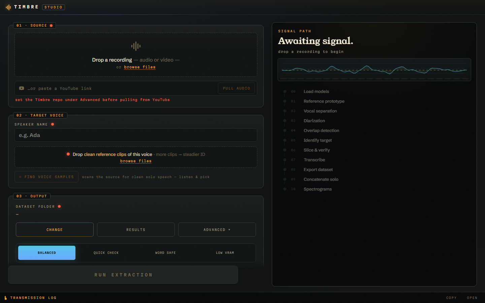
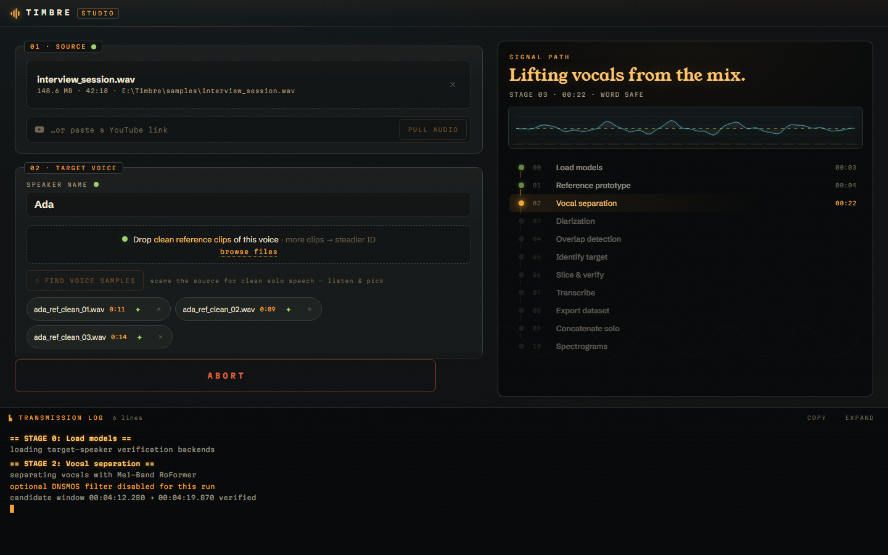
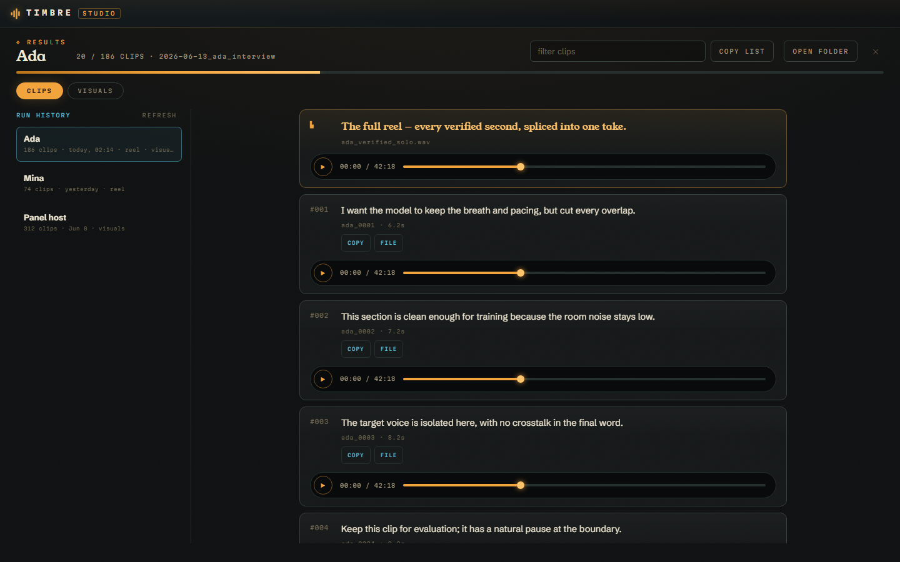
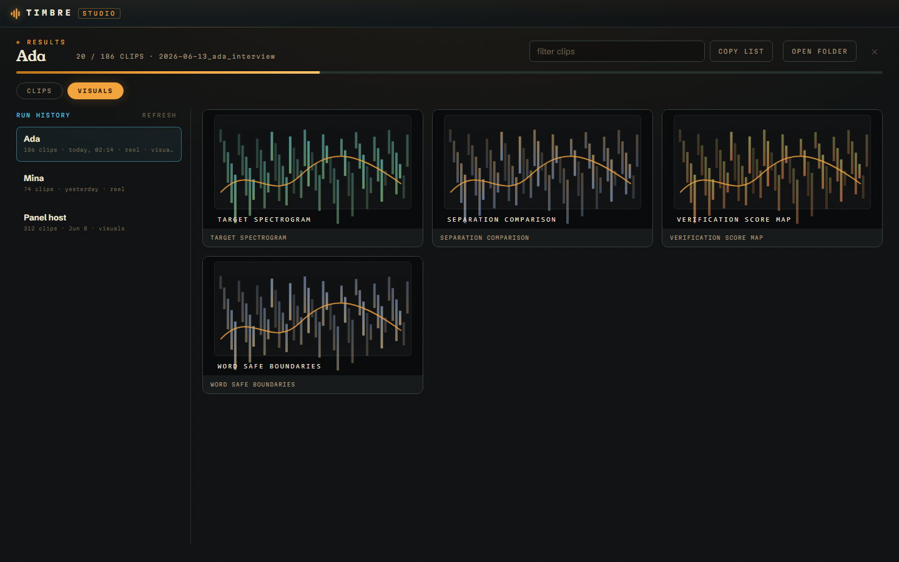
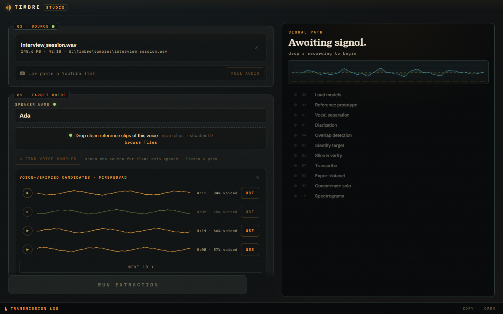

# Timbre Studio




Desktop console for the Timbre pipeline — drop a recording (or paste a
YouTube link), drop reference clips of the target voice, press **RUN
EXTRACTION**, and watch the real pipeline stages light up on the signal-path
rack while the transmission log streams live.

Built with [Tauri v2](https://v2.tauri.app) + vanilla TypeScript. The app is
a *console*, not a re-implementation: it shells out to `python run_timbre.py`
in the repo root and to `yt-dlp` for YouTube pulls, streaming both back over
IPC channels. On Windows, new users can also let **SETUP** provision a managed
runtime under a folder they choose instead of installing every tool by hand.

## First run for exe-only users

If someone only downloads the app installer/exe, the Studio window opens first
and checks the host machine. If Python, ffmpeg, yt-dlp, the repo, or FireRedVAD
are missing, use **OUTPUT → SETUP**:

1. Pick an install folder, for example `C:\Users\<you>\AppData\Local\TimbreStudio\runtime`
   or a larger drive such as `E:\TimbreStudioRuntime`.
2. The setup checklist shows the status of each managed piece. You can install
   missing items in two ways:
   - **Per piece:** each missing row has its own **INSTALL** button. It installs
     that item and any prerequisites it still needs, in order. For example,
     installing the VAD model first installs the repo, Python, and
     `yt-dlp`/`huggingface-hub` if they are missing. If a row cannot run yet, it
     shows **BLOCKED: needs ...** until its prerequisites are installed.
   - **All at once:** **INSTALL MISSING** installs every missing piece in
     dependency order. Once everything is present, the button changes to
     **REPAIR**.

   Only one install runs at a time. Progress appears in the transmission log,
   and every install is safe to rerun.
3. The managed pieces installed under that folder are:
   - `Timbre/` source tree from the latest GitHub release, falling back to `main`
     when no release exists.
   - `.venv/` Python 3.12 environment using `uv`.
   - `ffmpeg/bin/ffmpeg.exe` and `ffprobe.exe` (one install covers both).
   - Python requirements from `requirements.txt`, plus `yt-dlp` and
     `huggingface-hub`.
   - `pretrained_models/FireRedVAD`.
4. When the checklist is green, **USE** adopts the managed repo, Python, and
   output paths. The normal run button then uses those paths and prepends the
   managed ffmpeg/venv tools to spawned commands without changing system PATH.

> Managed install is Windows-only. On macOS/Linux the checklist still shows what is
> present, but the dependencies must be installed by hand (see Developer prerequisites).

This still downloads a large ML stack. CUDA/GPU, PyTorch, NeMo, GitHub/PyPI,
and Hugging Face failures are surfaced in the log; Setup does not fake a green
state unless the managed repo, Python modules, ffmpeg/ffprobe, yt-dlp, and VAD
model are actually detectable.

## Developer prerequisites

- Node.js 20+, Rust stable (for building the app)
- For unmanaged/dev runs: everything the pipeline itself needs
  (`pip install -r ../requirements.txt`), plus ffmpeg/ffprobe/yt-dlp on PATH.

## Develop

```bash
cd studio
npm install
npm run tauri dev
```

## Build an installer

```bash
npm run tauri build
```

## How it talks to the pipeline

| Rust command          | What it does                                                              |
| --------------------- | ------------------------------------------------------------------------- |
| `detect_env`          | Finds the repo root (walks up to `run_timbre.py`), python, yt-dlp, ffmpeg |
| `default_setup_dir`   | Returns the per-user managed-runtime folder default                       |
| `setup_status`        | Checks managed repo, venv modules, ffmpeg/ffprobe, yt-dlp, and VAD        |
| `start_setup`         | Streams the Windows managed install/repair flow (all pieces)              |
| `install_target`      | Installs one piece + its not-yet-ready prerequisites (per-row INSTALL)     |
| `start_pipeline`      | Spawns `python run_timbre.py <args>` with unbuffered/plain output         |
| `start_ytdlp`         | Pulls best-audio → wav into `<repo>/downloads/` (Colab notebook recipe)   |
| `generate_refs`       | Runs `extract_reference.py` to silence-split candidate voice samples      |
| `list_ref_candidates` | Reads the candidates manifest (longest-first export order)                |
| `read_audio`          | Streams wav bytes for in-app audition (blob URL + waveform)               |
| `keep_ref`            | Copies a picked sample to `<repo>/downloads/references/` (regen-safe)     |
| `cancel_task`         | Kills the whole process tree (`taskkill /T /F` on Windows)                |
| `probe_file`          | ffprobe duration + size for the file chips                                |
| `dataset_stats`       | Finds the newest `metadata.csv` under the output dir, counts clips        |
| `check_vad_model`     | Same dir test preflight applies — drives the missing-model banner         |
| `download_vad`        | One-time `FireRedTeam/FireRedVAD` fetch via huggingface_hub               |
| `run_overview`        | Newest reviewable run: dataset clips, visualizations, solo reel           |
| `clean_ref`           | Smart-clean a reference clip with the pipeline's vocal separator          |

Managed runtime commands are intentionally idempotent: partial `_extract`
folders are wiped, incomplete repos are backed up, and existing good pieces are
reused. Runtime updates and app updates are separate: app updates replace the
Tauri desktop shell; **SETUP / REPAIR** refreshes or repairs the managed Python
runtime and Timbre source tree.

For maintainers: the install pieces are modeled by the `SetupTarget` enum in
`src-tauri/src/lib.rs`. `build_setup_script(root, &targets)` emits the always-run
prelude plus only the gated blocks for the requested targets (`start_setup` passes
all seven; `install_target` passes one piece's prerequisite closure via
`prereqs_for`, pruning already-installed prerequisites with `target_ready`). The
frontend mirrors the prerequisite graph and per-row button state in the pure
`src/lib/setup-plan.ts` module (`prereqsFor` / `nextInstallable` / `rowState`),
which is unit-tested headlessly in `src/lib/setup-plan.test.ts`.

## App updates and release CI

The app uses Tauri's signed updater. The config creates updater artifacts and
checks:

```text
https://github.com/Etherll/Timbre/releases/latest/download/latest.json
```

The updater public key is committed in `src-tauri/tauri.conf.json`. The matching
private key must never be committed. This workspace generated a local key at:

```text
studio/.tauri/timbre-studio-updater.key
```

Before publishing releases, copy that private key content into the GitHub secret
`TAURI_SIGNING_PRIVATE_KEY`. If you regenerate the key, already-installed apps
will stop accepting future updates unless their embedded public key is updated
through a release signed by the old key.

Release workflow:

1. Keep these versions identical:
   - `studio/package.json`
   - `studio/src-tauri/tauri.conf.json`
   - `studio/src-tauri/Cargo.toml`
2. Push a tag like `studio-v0.1.0`.
3. `.github/workflows/studio-release.yml` validates TypeScript/Vitest/Vite/Cargo,
   then builds signed Windows/Linux/macOS Tauri bundles with `tauri-action`.
4. The GitHub release is drafted with installers, signatures, and `latest.json`.
5. Publish the draft release when the Tier-2 manual GPU checklist is satisfied.

Required CI secrets:

```text
TAURI_SIGNING_PRIVATE_KEY
TAURI_SIGNING_PRIVATE_KEY_PASSWORD
```

The current local key was generated without a password, so the password secret
may be left empty unless you generate a password-protected key.

## Cleaning a reference voice

Every reference chip has a **✦** action: it runs the pipeline's own vocal
separator (same Mel-Band RoFormer checkpoint as STAGE 2, GPU when available)
on that clip via `studio/scripts/clean_voice.py`, then decides what's actually
better instead of blindly swapping:

- real bleed under the voice → the isolated-voice wav replaces the reference
  (`<stem>_voice_only.wav` in `downloads/references/`), and the toast reports
  how loud the background was (e.g. *"background was 4 dB under the voice"*);
- background essentially silent → **keeps the original** (no pointless
  re-encode) and marks the chip verified-clean (green ✦);
- separator finds no reliable voice → keeps the original and says so.

Verdicts come from RMS levels of the separated stems
(`VERDICT::cleaned / already_clean / kept_original`, `BLEED_DB::…`,
`CLEANED::<path>` stdout markers). One clip cleans at a time; Esc cancels.

## Results browser




**RESULTS** (Output card, or **◈ REVIEW RESULTS** on the done card) opens a
full-screen browser over the newest reviewable run in the output folder:

- **CLIPS** — every dataset clip as a card: `#index`, the transcript from
  `metadata.csv` (RTL scripts lay out correctly), clip id + duration, and a
  pill player with a seekable scrub bar. One clip plays at a time. The pinned
  amber card on top is *the full reel* — the concatenated verified solo take.
  Clips page in twenties (`LOAD 20 MORE`).
- **VISUALS** — the run's `visualizations/` spectrograms and comparison plots
  as a gallery; click any card for a full-size lightbox.

Audio and images stream over Tauri's asset protocol (`protocol-asset`
feature + `assetProtocol` scope in `tauri.conf.json`), so nothing is loaded
into memory up front — the 40-minute reel starts instantly and seeks freely.
A run with no dataset (quality gate rejected everything, or `--no-export-tts`)
still opens: the browser falls back to whatever exists — reel, visuals — and
says why the clips list is empty.

The browser now includes a **RUN HISTORY** rail for previous reviewable runs
under the selected output folder. Pick any run to inspect it without changing
the newest-run default. The **CLIPS** tab also has transcript/id filtering,
one-click copy of the visible manifest lines, and per-clip **COPY** / **FILE**
actions for quick dataset triage.

## Presets and command preview

The Output card has four run presets:

- **BALANCED** — conservative pipeline defaults.
- **QUICK CHECK** — enables `--dry-run` for a short smoke run.
- **WORD SAFE** — enables word alignment and the higher-quality separation tier.
- **LOW VRAM** — favors launchability on smaller GPUs.

**COMMAND** opens a copyable `python run_timbre.py ...` preview generated from
the same pure settings helper used by the run button, so GUI flags stay aligned
with the CLI golden contract. **EXPORT**, **IMPORT**, and **RESET** make settings
portable while preserving local launch paths by default.

For frontend-only iteration, `npm run dev -- --host 127.0.0.1 --port 1420`
now opens without a Tauri shell. Native-only filesystem and process actions
still require `npm run tauri dev`.

## Voice-sample finder



**FIND VOICE SAMPLES** (in the Target Voice card) is the desktop version of the
notebook's Step 3, upgraded to be voice-aware. It runs
`studio/scripts/find_voice_samples.py`, which uses the repo's own VAD stack
(`timbre.vad`: FireRedVAD → Silero fallback, on CPU) to find windows dominated
by actual **speech** — music, jingles and applause are loud but not voice, so
they never become candidates. Windows are ranked steadiest-first (longest
continuous speech + voiced density) and spread across the file so ten samples
don't all come from the same minute. When no VAD backend is available it falls
back to `extract_reference.py`'s silence-splitting (the original notebook
recipe) and the panel header says `LOUDNESS-BASED` instead of `VOICE-VERIFIED`.

Candidates show ten at a time — **NEXT 10 →** swaps in the next page,
**↻ RESCAN** re-runs the scan. Audition each one in-app (waveform, position,
duration); **USE** copies a pick into `<repo>/downloads/references/` (so
regenerating candidates never orphans it) and adds it as a reference clip.
Pick as many as you like — multi-clip references are averaged into one
embedding prototype. Candidate count/length and the VAD backend are
configurable under Advanced.

Stage progress is parsed from the pipeline's own `== STAGE N: … ==` log
banners — nothing in the pipeline was changed to support the UI.

## Dependency note

`Cargo.lock` pins `time` to **0.3.47**: `time 0.3.48` added an impl that
conflicts with `cookie 0.18.1` (pulled in by tauri) and fails to compile
(E0119). If `cargo update` breaks the build with that error, re-pin:
`cargo update -p time --precise 0.3.47`.

## Regenerating the icon

```bash
python scripts/make_icon.py        # writes icon-src.png
npm run tauri icon icon-src.png    # regenerates src-tauri/icons/*
```
